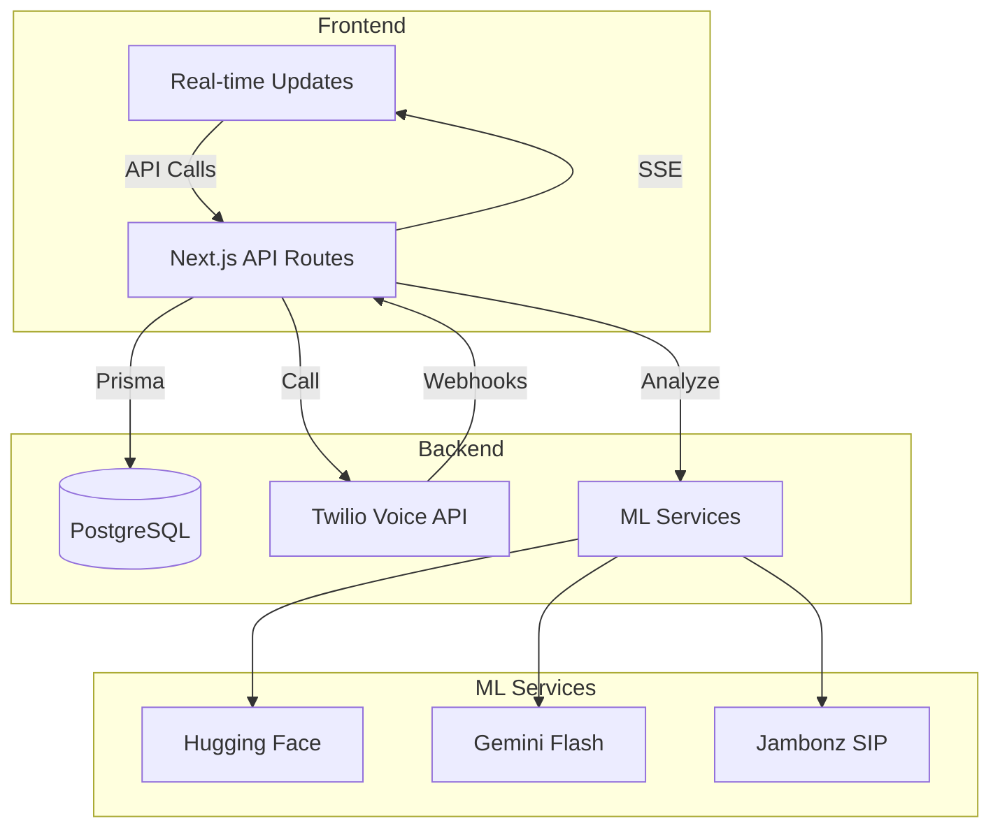

# Advanced Answering Machine Detection (AMD) Dashboard

A production-ready solution for detecting answering machines with multiple AI/ML strategies. Built with modern web technologies:

- **Frontend**: Next.js 14 (TypeScript, App Router)
- **Database**: PostgreSQL with Prisma ORM
- **Authentication**: NextAuth.js
- **Call Processing**: Twilio Voice API
- **AI/ML Models**: Hugging Face, Gemini Flash, Jambonz SIP
- **Real-time Updates**: Server-Sent Events (SSE)

## 🚀 Quick Start

1) Install deps and set env
```
pnpm i # or npm i / yarn
cp .env.example .env
```

2) Start Postgres and push schema
```
npx prisma generate
npx prisma db push
```

3) Run Next.js
```
npm run dev
```

4) (Optional) Run AMD FastAPI service
```
cd ../amd-service
pip install -r requirements.txt
uvicorn main:app --reload --port 8000
```

5) Configure a tunnel if testing Twilio webhooks (required for real calls)
- Use `ngrok http 3000` or Cloudflare Tunnel
- Set `NEXT_PUBLIC_BASE_URL=https://your-tunnel.example` in `.env`
- Configure Twilio to allow the URL

## ✨ Key Features

### Multi-Strategy AMD Detection
- **Twilio Native** - Built-in detection with high accuracy
- **Hugging Face ML** - Advanced speech recognition models
- **Gemini Flash** - AI-powered conversation analysis
- **Jambonz SIP** - SIP-based detection for telecom networks

### Real-time Analytics Dashboard
- Live call monitoring and metrics
- Performance comparison across strategies
- Accuracy and confidence scoring
- Cost analysis and optimization

### Comprehensive Call Management
- Complete call history with filters
- Detailed call logs and recordings
- Exportable reports (CSV/PDF)
- Search and filter capabilities

## 🔒 Security & Best Practices

- **Input Validation**: Zod schema validation for all API endpoints
- **Authentication**: Secure JWT-based sessions with NextAuth.js
- **Environment Variables**: Sensitive configuration via `.env` files
- **HTTPS**: Enforced for all webhook endpoints
- **Error Handling**: Comprehensive error logging and user feedback
- **Rate Limiting**: Protection against abuse
- **CORS**: Strict origin policy for API endpoints

## 🏗️ System Architecture



### Key Components
1. **Frontend**: Responsive dashboard built with Next.js 14 and Tailwind CSS
2. **API Layer**: Type-safe API routes with Zod validation
3. **Database**: PostgreSQL with Prisma ORM for data persistence
4. **Call Processing**: Twilio for call handling and webhooks
5. **AI/ML Services**: Multiple detection strategies with fallbacks

## 🛠️ AMD Strategies in Detail

### Twilio Native
- **Implementation**: Native `machineDetection` with `asyncAmd`
- **Timeout**: Configurable (default: 3s)
- **Best For**: Quick detection with minimal setup
- **Limitations**: Basic detection capabilities

### Hugging Face ML
- **Model**: wav2vec2-base-960h
- **Features**:
  - Speech-to-text transcription
  - Voicemail pattern detection
  - Confidence scoring
- **Endpoint**: `/api/huggingface/predict`

### Gemini Flash
- **Model**: gemini-1.5-flash
- **Features**:
  - AI-powered analysis
  - Natural language understanding
  - Context-aware detection
- **Endpoint**: `/api/gemini/analyze`

### Jambonz SIP
- **Type**: SIP-based detection
- **Features**:
  - Telecom-grade detection
  - Low latency
  - SIP trunk integration
- **Endpoint**: `/api/jambonz/call`

## 📡 Webhook Integration

### Twilio Webhook Payload Example
```json
{
  "CallSid": "CAxxxxxxxxxxxxxxxxxxxxxxxxxxxxxxxx",
  "CallStatus": "completed",
  "AnsweredBy": "human",
  "CallDuration": "45",
  "RecordingUrl": "https://api.twilio.com/..."
}
```

### Webhook Endpoints
- `POST /api/twilio/webhook` - Handle Twilio call status updates
- `POST /api/jambonz/amd` - Process Jambonz AMD results

## 🚧 Development Roadmap

### Short-term
- [ ] Implement WebSockets for real-time updates
- [ ] Add audio recording storage (S3/Google Cloud Storage)
- [ ] Enhance error handling and retry logic

### Medium-term
- [ ] Add multi-tenant support
- [ ] Implement role-based access control
- [ ] Add automated testing suite

### Long-term
- [ ] Support for custom ML models
- [ ] Advanced analytics dashboard
- [ ] Mobile app integration

## 📚 Documentation

For detailed documentation, please see:
- [API Reference](/docs/API.md)
- [Deployment Guide](/docs/DEPLOYMENT.md)
- [Troubleshooting](/docs/TROUBLESHOOTING.md)

## 🤝 Contributing

We welcome contributions! Please see our [Contributing Guide](CONTRIBUTING.md) for details.

## 📄 License

This project is licensed under the MIT License - see the [LICENSE](LICENSE) file for details.

---

<div align="center">
  Built with ❤️ by Sanjana Bonagiri
</div>
